# Architecture

`commits-metadata` extracts structured **feature metadata** from GitHub commits.
A single commit, a whole repository, or an entire organization can be processed
through one deterministic pipeline; an optional LLM analyzer adds a natural
language summary on top of the rule-based engine.

The diagram below maps 1:1 to the package layout under [`app/`](../app):

```mermaid
flowchart LR

    User["User / Developer"]

    subgraph HF["Hugging Face Space"]
        UI["Gradio UI"]
        API["App Controller / API Layer"]
        SingleCommit["Single Commit Processor"]
        BatchTrigger["Batch Processing Trigger"]
        Exporter["JSON Exporter"]
    end

    subgraph InputLayer["Input Layer"]
        CommitURL["Commit URL Input"]
        RepoURL["Repository URL Input"]
        OrgURL["Organization URL Input"]
        Config["Processing Config"]
    end

    subgraph GitHubLayer["GitHub Integration Layer"]
        URLParser["GitHub URL Parser"]
        GitHubClient["GitHub API Client"]
        RateLimiter["Rate Limit Handler"]
        Auth["GitHub Token / Secrets"]
    end

    subgraph DiscoveryLayer["Commit Discovery Layer"]
        RepoScanner["Repository Scanner"]
        BranchScanner["Branch Scanner"]
        CommitLister["Commit List Fetcher"]
        CommitDeduplicator["Commit SHA Deduplicator"]
    end

    subgraph QueueLayer["Processing Queue"]
        JobQueue["Job Queue"]
        RetryQueue["Retry Queue"]
        DeadLetterQueue["Failed Commit Queue"]
    end

    subgraph ProcessingLayer["Commit Processing Engine"]
        CommitFetcher["Commit Detail Fetcher"]
        DiffExtractor["Diff / Patch Extractor"]
        FileClassifier["Changed File Classifier"]
        RuleEngine["Rule-Based Metadata Extractor"]
        LLMAnalyzer["Optional LLM Analyzer"]
        SchemaBuilder["Feature Metadata Builder"]
        JSONValidator["JSON Schema Validator"]
    end

    subgraph StorageLayer["Storage Layer"]
        CommitStore["Raw Commit Store"]
        MetadataStore["Feature Metadata Store"]
        RepoStateStore["Repo Processing State"]
        Cache["API Response Cache"]
    end

    subgraph OutputLayer["Output Layer"]
        JSONResponse["Fixed JSON Response"]
        DownloadJSON["Download JSON File"]
        SearchView["Search / Browse Processed Commits"]
        Dashboard["Processing Dashboard"]
    end

    subgraph AutomationLayer["Automation Layer"]
        Scheduler["Scheduled Backfill Job"]
        Webhook["GitHub Webhook Receiver"]
        IncrementalProcessor["Incremental Commit Processor"]
    end

    subgraph ObservabilityLayer["Observability"]
        Logs["Logs"]
        Metrics["Metrics"]
        ErrorTracker["Error Tracker"]
    end

    User --> UI

    UI --> CommitURL
    UI --> RepoURL
    UI --> OrgURL
    UI --> Config

    CommitURL --> API
    RepoURL --> API
    OrgURL --> API
    Config --> API

    API --> URLParser
    URLParser --> GitHubClient
    Auth --> GitHubClient
    GitHubClient --> RateLimiter

    API --> SingleCommit
    API --> BatchTrigger

    SingleCommit --> CommitFetcher

    BatchTrigger --> RepoScanner
    RepoScanner --> BranchScanner
    BranchScanner --> CommitLister
    CommitLister --> CommitDeduplicator
    CommitDeduplicator --> JobQueue

    Scheduler --> BatchTrigger
    Webhook --> IncrementalProcessor
    IncrementalProcessor --> JobQueue

    JobQueue --> CommitFetcher
    RetryQueue --> CommitFetcher

    CommitFetcher --> GitHubClient
    CommitFetcher --> CommitStore
    CommitFetcher --> DiffExtractor

    DiffExtractor --> FileClassifier
    FileClassifier --> RuleEngine
    RuleEngine --> LLMAnalyzer
    RuleEngine --> SchemaBuilder
    LLMAnalyzer --> SchemaBuilder
    SchemaBuilder --> JSONValidator

    JSONValidator --> MetadataStore
    JSONValidator --> JSONResponse
    JSONValidator --> Exporter

    Exporter --> DownloadJSON
    MetadataStore --> SearchView
    MetadataStore --> Dashboard
    RepoStateStore --> BatchTrigger
    Cache --> GitHubClient

    CommitFetcher --> Logs
    JSONValidator --> Logs
    JobQueue --> Metrics
    DeadLetterQueue --> ErrorTracker
    RetryQueue --> ErrorTracker

    JSONResponse --> UI
    DownloadJSON --> UI
    SearchView --> UI
    Dashboard --> UI
```



## Component → code map

| Diagram node | Module |
|---|---|
| App Controller / API Layer | [`app/main.py`](../app/main.py) |
| Gradio UI | [`app/ui.py`](../app/ui.py) |
| Processing Config / Input Layer | [`app/config.py`](../app/config.py), [`app/models.py`](../app/models.py) |
| GitHub URL Parser | [`app/github/url_parser.py`](../app/github/url_parser.py) |
| GitHub API Client / Auth | [`app/github/client.py`](../app/github/client.py) |
| Rate Limit Handler | [`app/github/rate_limiter.py`](../app/github/rate_limiter.py) |
| Repo / Branch / Commit scanners + Deduplicator | [`app/discovery/scanner.py`](../app/discovery/scanner.py) |
| Job / Retry / Dead-Letter queues | [`app/jobqueue/job_queue.py`](../app/jobqueue/job_queue.py) |
| Diff Extractor | [`app/processing/diff_extractor.py`](../app/processing/diff_extractor.py) |
| Changed File Classifier | [`app/processing/file_classifier.py`](../app/processing/file_classifier.py) |
| Rule-Based Metadata Extractor | [`app/processing/rule_engine.py`](../app/processing/rule_engine.py) |
| Optional LLM Analyzer | [`app/processing/llm_analyzer.py`](../app/processing/llm_analyzer.py) |
| Feature Metadata Builder | [`app/processing/schema_builder.py`](../app/processing/schema_builder.py) |
| JSON Schema Validator | [`app/processing/validator.py`](../app/processing/validator.py) + [`app/schema/feature_metadata.schema.json`](../app/schema/feature_metadata.schema.json) |
| Processing Engine (orchestration) | [`app/processing/engine.py`](../app/processing/engine.py) |
| Storage Layer (commit/metadata/state/cache) | [`app/storage/stores.py`](../app/storage/stores.py) |
| JSON Exporter / Download | [`app/exporter.py`](../app/exporter.py) |
| Scheduler / Webhook / Incremental | [`app/automation/`](../app/automation) |
| Logs / Metrics / Error Tracker | [`app/observability/telemetry.py`](../app/observability/telemetry.py) |

## Pipeline order

```
URL → parse → discover SHAs (dedupe) → queue → fetch commit → extract diff →
classify files → rule engine (+ optional LLM) → build metadata → validate →
store → serve / export
```

Failures inside the engine are routed to the **retry queue** up to
`max_retries`, then to the **dead-letter queue** where the error tracker records
them. Everything is in-memory so a Hugging Face Space boots with zero external
dependencies; the store interfaces are swappable for Redis/SQLite later.
